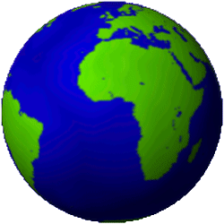

</a>
 
<h2 align="center"><b>Geography Game</b></h2>
<h4 align="center">A simple game to test your knowledge of geography.</h4>

## Features

- Name countries, capitals, and continents.
- Read the Rules page in-app to learn how to play.
- Change your game settings to choose whether to include countries, capitals, and/or continents as well as colloquial and/or official names.
- Single-player and two-player gamemodes.

## Screenshots

   

   

## Features To Implement

- Improve input validation
- Display list of possible moves at game win, tie, and end
- Improve UI/UX

## License
  

This project is licensed under the GNU General Public License v3.0.
